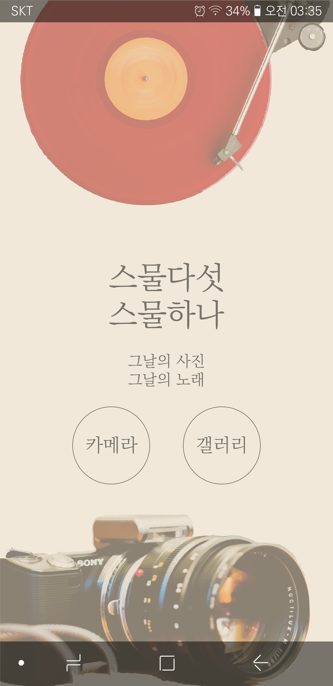
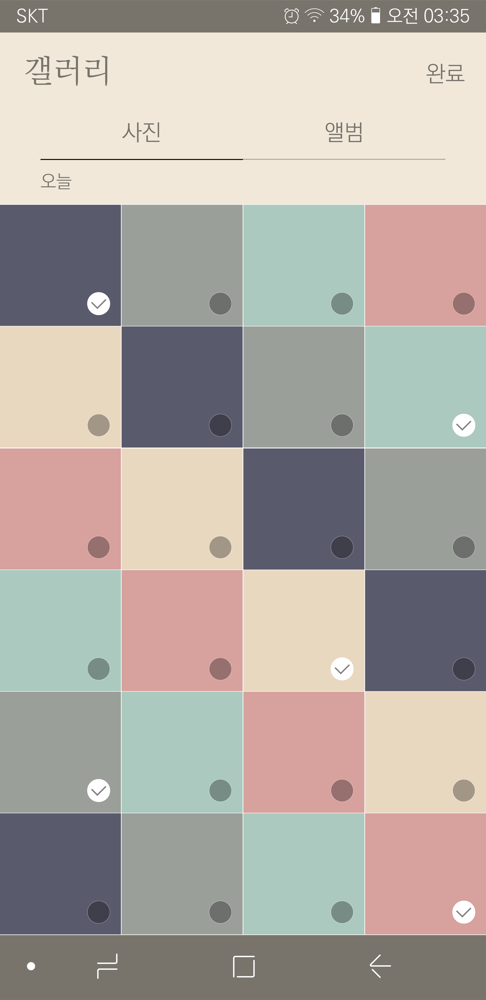
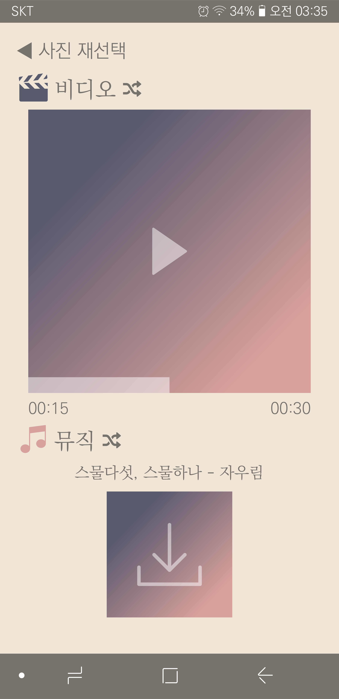
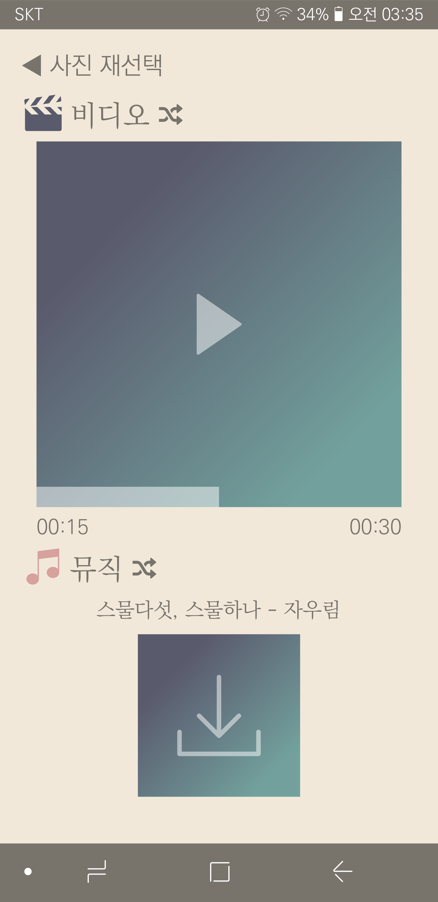
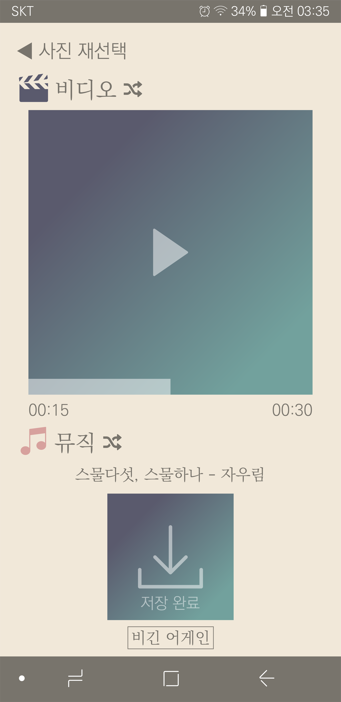

# FrontendApp 

2018 OpenHack TeampleStay team -Front End Application Repository

The smartphone has a built-in function that collects pictures together with specific background music as a story. However, this functions make background music that is not related to photos. This app makes your own story by recommending the best song to the photo. 
It recommends music by labeling each photo using google vision api and analyzing its features.

## Demo
| Main | Select | Result | Random | Restart |
| --- | --- | --- | --- | --- |
|  |  |  |  |  |

[Presentation video]()

## Technical Support

Label images using [Google Cloud Vision API](https://cloud.google.com/vision/)

## Development Environment

### FrontEnd
* Platform:	Android
* Tool:	Android Studio
* Language: Java
* System: Windows
* Setting

|  | version |
|:--------|:--------|
| Gradle | 3.3 |
| Plugin | 2.3.3 |
| Complie Sdk | API 26: Android 8.0(Oreo) |

### BackEnd
* Framework:	
* Language: JavaScript
* System: Windows

## Licensing
